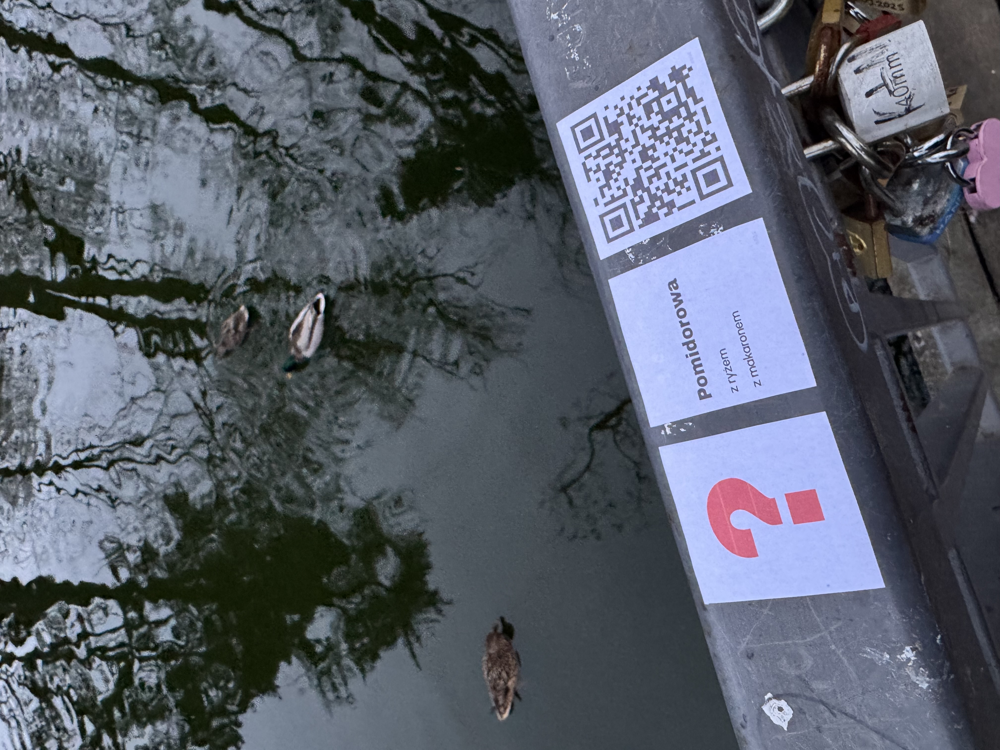

<p align="center">
  
  
  
  
  
  
  
</p>

# jakmyślisz?

**A street art survey project — QR code stickers placed around the city, anonymous voting, live results.**

jakmyślisz is a social experiment running in Częstochowa, Poland. Stickers with questions and QR codes appear in public spaces — residents scan, vote anonymously, and instantly see what others think.

The goal is to spark reflection, conversation, and curiosity about everyday topics — directly on the street.

---

## 🚀 Status & Demo

**Status:** Live
**Live URL:** https://jakmyslisz.com/

### 👉 [Live Demo — jakmyslisz.com/demo](https://jakmyslisz.com/demo)

The demo gives full access to the admin panel with realistic mock data — no login required.
From the demo you can also preview the full voting flow:

- **Admin panel:** https://jakmyslisz.com/demo
- **Example question (voting flow):** https://jakmyslisz.com/demo/pytanie/pomidorowa
- **Another one:** https://jakmyslisz.com/demo/pytanie/symulacja

> The real experience starts with scanning a physical QR sticker placed in the city.
> Demo data is example-only — nothing is saved.

---

<p align="center">
  
  <br/>
  <em>Stickers on a bridge railing in Częstochowa</em>
</p>

---

## ✨ Features

- Anonymous voting via QR codes
- **Open-ended questions** — users can type their own answer; AI normalizes it in real-time (typos, informal names, descriptions all mapped to canonical values)
- **AI moderation** — nonsense inputs are rejected before saving
- Dynamically growing option list — answers added by previous users appear as clickable choices for the next
- Location tracking per scan (`?loc=rynek`)
- Duplicate vote prevention (localStorage)
- Bar chart results shown after voting
- Random fun fact after each vote
- Automatic night mode (10 PM – 6 AM)
- Admin panel with live stats and scan→vote conversion rate
- QR sticker generator — individual stickers + A3 print sheets (configurable layout)
- Mobile-first, no registration required

---

## 🛠 Tech Stack

- React 18 + Vite
- Firebase Firestore
- SCSS
- React Router DOM
- Netlify (auto-deploy from GitHub) + Netlify Functions (serverless)
- **Claude Haiku (Anthropic API)** — real-time answer normalization and moderation for open-ended questions

---

## 📁 Project Structure

```bash
src/
  components/   # Question, Home, AdminPanel, ...
  data/         # questionsData.js, factsData.js
  App.jsx
  App.scss
public/
  favicon.svg
```

---

## 👤 Author

Łukasz Nowak
GitHub: https://github.com/enowuigrek

---

## 📄 License

MIT
